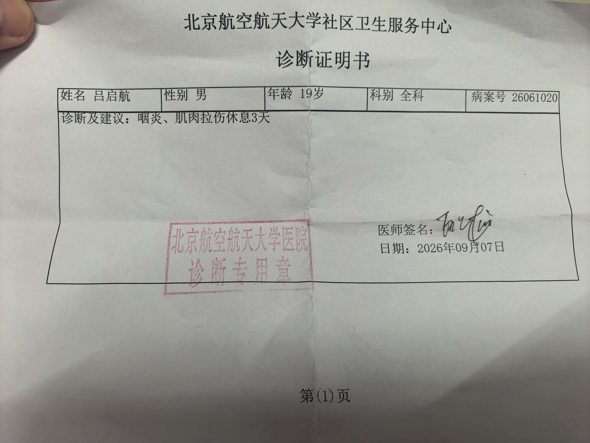

$\textbf{2026/07/27}$
$\texttt{写日记 Day1}$
$\texttt{看看能坚持几天}$
$\texttt{利用千问搭建了github + vscode，也算是为自己的 ACM 生涯开一个头了}$
$\texttt{短期规划：手写补全所有模板}$
$\texttt{长期规划：小号CF/ATC上红}$

$\textbf{2026/07/28}$
$\texttt{写日记 Day2}$ 
$\texttt{简单完善了组合数学，线性代数开了个头}$

$\textbf{2026/07/29}$
$\texttt{写日记 Day3}$
$\texttt{矩阵，行列式，求逆}$
$\texttt{QianWen 还是调教得不够好}$
$\texttt{明天科二，希望一遍过}$

$\textbf{2026/07/30}$
$\texttt{写日记 Day4}$
$\texttt{科目二100pts}$

$\textbf{2026/07/31}$
$\texttt{写日记 Day5}$
$\texttt{难得的 Tish 时间，明天有 CF 记得打}$

$\textbf{2026/08/01}$
$\texttt{Tish 打CF}$

$\textbf{2026/08/02}$
$\texttt{不管罚时怎么样，反正是过了 5 个题，比上次厉害了}$

$\textbf{2026/08/03}$
$\texttt{Tish}$

$\textbf{2026/08/04}$
$\texttt{今天有 Div3，为数不多的 Div3 了}$

$\textbf{2026/08/05}$
$\texttt{虽然没有罚时，而且过了 6 道题，但无奈我是 Untrusted User，不过这样更好了}$
$\texttt{明天又有 Div2}$ 

$\textbf{2026/08/06}$
$\texttt{每天应该提前写这个.. Div2}$

$\textbf{2026/08/07}$
$\texttt{昨天打完 Div2，今天又有 EDU，含 CF 浓度最高的一集}$

$\textbf{2026/08/08}$
$\texttt{被 EDU 的 E 阴到了，Wrong Answer on test 21 是你吗}$

$\textbf{2026/08/09}$
$\texttt{Div2}$ 

$\textbf{2026/08/10}$
$\texttt{Div2 居然下分了，我真是个这个}$

$\textbf{2026/08/11}$
$\texttt{今天又是充实的一天}$

$\textbf{2026/08/12}$
$\texttt{接下来几天啥都干不了，遂提前写了}$

$\textbf{2026/08/13}$
$\texttt{外出}$

$\textbf{2026/08/14}$
$\texttt{外出}$

$\textbf{2026/08/15}$
$\texttt{外出}$

$\textbf{2026/08/16}$
$\texttt{外出}$

$\textbf{2026/08/17}$
$\texttt{外出}$

$\textbf{2026/08/18}$
$\texttt{外出}$

$\textbf{2026/08/19}$
$\texttt{回来了，并配置了新的 PC}$
$\texttt{Thinkbook16+ 5070 i7}$
$\texttt{新电脑测试}$

$\textbf{2026/08/20}$
$\texttt{充实的一天}$

$\textbf{2026/08/21}$
$\texttt{认识了新室友，一个bj，一个sd，一个hb}$

$\textbf{2026/08/22}$
$\texttt{buaa 迎新活动，认识了几位大咖}$

$\textbf{2026/08/23}
$\texttt{明天科目三，希望通过}$

$\textbf{2026/08/24}$
$\texttt{科目三 100 pts，明天科目四，席位通过}$

$\textbf{2026/08/25}$
$\texttt{驾驶证拿到了，明天准备出发}$

$\textbf{2026/08/26}$
$\texttt{充实的一天}$

$\textbf{2026/08/27}$
$\texttt{北京随便逛逛}$

$\textbf{2026/08/28}$
$\texttt{提前先写，避免没时间}$
$\texttt{upd:第一天报道，感觉很科幻。室友：wzg，hwz，}$

$\textbf{2026/08/29}$
$\texttt{提前先写，避免没时间}$
$\texttt{upd:军训第一天，简单记录下内容随便写一些偶然看到的}$
$\texttt{早上吃的鸡蛋+油条+混沌，才花 5 RMB...，好像是二食堂，明天早上应该也是这个，要留意一下。}$
$\texttt{上午开营仪式，教官姓姚（他上午明明说自己姓葛...，学习练军姿，左右对齐}$
$\texttt{中午在另外一个食堂..，不知道是哪一个，享用单人自助，奥尔良鸡腿，两大片肉，番茄炒蛋，山药类似的东西..}$
$\texttt{由于上午练得太烂了...，下午先在太阳下站了 1h..，后面学了转弯（不是科目二那个）}$
$\texttt{下午吃的藤椒抄手，第一次在餐馆里面吃到藤椒口味的...}$
$\texttt{出来然而并没有和我一起回七公寓的同学，撞大运（一语双关）跟着好心同学一起回来了，还好没被督察的抓到。}$
$\texttt{回宿舍洗了下衣服，惊奇地发现大家都在..}$
$\texttt{晚上居然有文艺表演项目...，符合刻板印象，很好的是没有抓我上去，坏的是最后的八名女生没见到，伟大的教官摇过来两名女生，好像都姓赵，具体名字忘了...。虽然玩的很 high 但比舞大获全败，四个营中只拿了第三名。学会了如何蹲下！如何起立！希望明天学习如何走路！}$
$\texttt{姚教官最后说了些语重心长的话，好像军训真的是有三分是训给自己看的，七分给别人看的}$
$\texttt{军训大部分时间都在思考人生..，或者说是在发呆，话说回来我已经很久都没有在学校体验学习的乐趣了，是那种获得新知识，思维瞬间拓宽的快感，我想学校的设计初衷或许如此，可惜在高三我只能在深圳当个小商家，天天炒冷面，把学过的冷过的知识一遍遍炒熟。回想起来知识输入最密集的日子，那些天天在积分听jzp或者学长讲课的日子一去不复返了。但是我觉得，也应该认为，这种快感会马上回显}$
$\texttt{室友都这么爱玩游戏和爱刷视频吗...，第一天住的感觉不管怎么说很奇怪..}$
$\texttt{剩下没想到了明天再补充..}$

$\textbf{2026/08/30}$
$\texttt{给我都提前猜到了...，上午学习单人走路，教官讲他的一些逸事，包括高考520，英语46分和他的两个exnpy}$
$\texttt{中午终于摇到一个人...，和dxp一起，在3食堂吃了番茄牛腩，感觉没家里的好吃...}$
$\texttt{午休的时候室友在 genshin，有点影响睡眠。}$
$\texttt{下午学习集体走路，由于没走好被加训了，虽然我不知道这算加训还是算减训。}$
$\texttt{吃的鸡排拌饭，感觉非常辣鸡，下次别吃了。}$
$\texttt{晚上学习八套军体拳，教官开始摸鱼了，今天居然由有三个人被抓，感觉教官对我们失去信心了。}$
$\texttt{晚上有好梦拓过来送东西。}$
$\texttt{天哪，25届的cq女生居然是班上的3.9/4.0，被震惊到了，但是感谢我们的熊梦拓！要到了联系方式！}$

$\textbf{2026/08/31}$
$\textbf{提前先写，避免没时间}$
$\texttt{上午学习抬腿...，居然是最早放的一次。}$
$\texttt{中午吃的五花肉和烤鸭，焦味太重了，不过爆的汁挺多。}$
$\texttt{下午居然有军事社团来提供改枪码，可惜摸到的不是真枪，不过算是最轻松的一个下午了。}$
$\texttt{晚上选了个看起来好吃的鸡汁米线，但实际上味道一般，尝试更换酸梅汤为木瓜汁，这 tm 是什么玩意。}$
$\texttt{wzg 吃的都比较新奇..，什么生煎包，烤冷面，cq 小伙没吃过这些新奇玩意}$
$\texttt{晚上康导讲了一下选课，和hwz，dxp随便逛了逛校园，去cotti coffee 花9.9 RMB 随便买了个咖啡，但感觉味道和蜜雪冰城的茉莉奶绿差不多...，，随便进去一个计算机学院的空教室都有人...，感觉还是太卷了，还得是我们计拔班。}$
$\texttt{正在研究为什么踏步会越踏越快的问题，可以列为论文参考主题之一。}$

$\textbf{2026/09/01}$
$\texttt{早上居然要吃两个肉夹馍，我真成 David Dai 了（ll}$
$\texttt{上午学习正步走。}$
$\texttt{中午吃的奇怪的牛肉拌饭，和 BS 二楼的某个菜很像。}$
$\texttt{下午打枪，果然还是摸不到荷枪实弹啊，拿个什么激光打，教官说要三点一线，可惜我右眼近视，可惜我不会单闭右眼，在基本上模糊下乱打打了60多分，还有神秘灭火练习}$

$\texttt{还有这种奇怪自救社团，请问谁的爱好是自救？}$
$\texttt{回来之后前面的一名同学由于[你吼那么大声干什么啦]被教官杀鸡儆猴了，连长+团长的组合拳还是太有威力，足足值得为这名同学进行 1 ms 的停工缅怀。}$
$\texttt{晚上吃到好东西了，美味的肥牛滑蛋，我草太下饭了。}$
$\texttt{进行了进入大学后的第一场考试，早知道阅读做这么快就好好看听力了，下次一定，嗯，下次一定。}$
$\texttt{明天大清早要执勤啊}$

$\textbf{2026/09/02}$
$\texttt{md，早上执勤居然没定闹钟，但靠吃老本的老时钟在起床内五分钟成功下楼！}$
$\texttt{另一位同学是河北衡中的，强大！！！}$
$\texttt{早上吃的葱油饼，还不错}$
$\texttt{上午啥也没学，还是练习走路，发现我不会走路了，我们这一列不会走路了，我们所有人都不会走路了。}$
$\texttt{中午居然只有 20 min 的 Tish 时间，只能 rush 一下豌杂面，味道一般...，可能是在 cq 吃太好了}$
$\texttt{下午尝试学习冷兵器，学习著名的从女子学校流传至军队的🗡操}$
$\texttt{下午忘记整啥花活了，还是吃的烤鸭和五花肉。}$
$\texttt{晚上教官不在疯狂 Tish，一个小时之后教官疯狂了，还好我们8点钟可以提前回来。}$

$\textbf{2026/09/03}$
$\texttt{早上还是那牢三样，点了个不知道是什么的咸菜居然还要钱}$
$\texttt{上午干啥忘了，站半个小时军姿后能忘记什么事情了。}$
$\texttt{中午和其他两个室友去了北区食堂吃饭，吃的蟹黄加一堆东西的饭，不好评价，但是吃了两个🍉，爽}$
$\texttt{对不起，站军姿是下午的事情，上午终于在室内了，可能算是我们的第一堂早八（，学唱校歌，虽然依托答辩但是讲课学长更加答辩，可能以为我们都有乐理基础吧。}$
$\texttt{教官似乎不太会用 qq 音乐的样子，让我们学唱红歌，拼刺刀，忘了。一杆钢枪，忘了。}$
$\texttt{下午走来走去了，不知道走出了什么名堂。}$
$\texttt{你说得对，但是今天是星期四，v我50，222 寝室集体团建疯狂星期四，美中不足的是没有汉堡，感觉没有吃饱。}$
$\texttt{晚上连续训练了一个半小时，然后坐了一个半小时，教官开始思想教育环节，“你们要尊重我”，“人与人是要互相尊重的”，还是强大的，不去海陆空炮去了酒泉卫星发射中心，还得是我们军事航天部队的！！}$
$\texttt{难道站军姿过久半月板是会损伤的吗，还是别去当军人了（}$

$\textbf{2026/09/04}$
$\texttt{早上没吃饭，因为室友太懒了，而且上午有开学典礼。}$
$\texttt{怎么北航里面这么多小情侣，受不了了我也要找一个。}$
$\texttt{上午提前溜回来买了一提水，一袋面包居然只要四块钱...，校内校外物价差异显著啊。终于调试好了编译，现在按 ctrl + shift + B 终于可以一键编译了。}$
$\texttt{中午由于 hwz 急着上王者，于是只能自己去吃饭了。吃着吃着对面突然坐过来一对小情侣，还是被别人豪到了，人输！}$
$\texttt{下午怎么还要军训啊，天天练习正步，太正了！}$
$\texttt{晚上本来想约 qylx 一起去吃饭的，结果被告知晚上还要训，mlgbd，还好她也要训，我们互相都把对方鸽了（}$
$\texttt{学习齐步换正步，就这玩意能学一晚上？}$
$\texttt{tmd 考口语为什么不让回去换衣服啊，还只能穿军训服，2 机房我后面是那位坐轮椅的同学，本来打算去打招呼了，但看到旁边的人太多了就没去了...}$
$\texttt{我考口语太唐了，全世界找不到和我一样唐的人，但可能大家都在说胡话吧，希望如此（}$
$\texttt{跟 224 宿舍一起回去了，运气不错。}$
$\texttt{晚上开始疯狂聊天，genshin impact 都没怎么打。}$
$\texttt{其实今天写的已经迟到了，还有一些东西没回忆起，以后要多留点时间来写了。}$

$\textbf{2026/09/05}$
$\texttt{早上的豆浆不是豆浆，稀饭不是稀饭，学一食堂不是学一食堂。}$
$\texttt{上午学习了正步换齐步，齐步换正步，正步换齐步...}$
$\texttt{休息的时候把帽子取了结果被教官拉去唱歌了，激情献唱 Counting Stars。}$
$\texttt{最热的一次，第一次把外套都打湿了...，还是休息的时候再洗吧..}$
$\texttt{中午吃的鸡排拌饭，这么大个碗装这么点饭好意思么，等军训}$
$\texttt{计拔班 cq 团建了。}$
$\texttt{下午踢腿居然被教官表扬了，我觉得应该是因为我腿短 + 体重大 + 高三天天夜跑的原因。}$
$\texttt{天太热了，吃饭之前又把外套打湿了（}$
$\texttt{下午见证了 “连续一定可倒，可导不一定连续”}$
$\texttt{下午吃的肘子五花肉饭，烧烤烤焦的五花肉太香了，蓝莓圣代感觉味道一般般，下次试试蜜雪冰城的。}$
$\texttt{晚上怎么还要训啊，原来是坐下唱歌环节啊，还行吧，但我怎么又被抽中了，还好我早有准备，还有立体环绕式音响助力，激情献唱 Wake me up。}$
$\texttt{怎么不是半夜军训是凌晨 5 点啊，一点也不给力。}$

$\textbf{2026/09/06}$
$\texttt{凌晨 3 点半起的，所以又是没吃早饭的一天（}$
$\texttt{四营四连的教官给我唐完了，营长也唐完了。我不穿运动鞋跑，唐完了。后面的人一直踩我脚，唐完了。右前方的人还没走出体育场铺盖就松了，唐完了。}$
$\texttt{拉练怎么不足两个小时啊，学学人家 thu 和上交吧，唐完了。}$
$\texttt{拉练后怎么休息两个小时又要训啊，唐完了。}$
$\texttt{中期慰问怎么是我们给领导做样子啊，看来 buaa 深陷形式主义的荼毒了，buaa 没救了。}$
$\texttt{我可能确实耳朵有点问题，导致我晚 10 min 才进主楼，正好她也马上出去了，可惜这次是错过了。不过没错过她也被两个女生围着的，根本没有办法进攻（}$
$\texttt{dxp 吃饭的时候给我把可乐弄倒了，只能中午把裤子和内裤都洗了}$
$\texttt{加了另一位徐梦拓，似乎很喜欢运动啊，那还不赶紧约一个}$
$\texttt{下午正步转齐步，齐步转正步，没完了。左脚的水泡越来越大了，哎}$
$\texttt{晚上吃的烧烤虾仁滑蛋饭，看来咱们 cq 的就是喜欢烧烤的香味啊，买了个青提柠檬 cost 12 RMB，感觉不如酸梅汁。是不是你只要里面有切片或者果粒就可以随便涨价啊？可乐 1.6 一杯还可以，以后建议都买 5 RMB 以下的饮料。}$
$\texttt{哎，晚上怎么是合唱朗诵比赛环节？这抽签是有内幕吧，1/24 的概率都给你抽到 2143 了？}$
$\texttt{shaber 2 营开场优势全占了，朗诵怎么咱们女生还能念错啊，遗憾离场获得第三名。不过四个营的朗诵太同质化了，全靠道具加分（。结果遗憾获得 rk 3}$
$\texttt{合唱 2 营开局就给所有营压力，1 营是什么水歌啊，试图用数量胜过质量是不行的。然而，在面对 2 营的压力下，4 营开局就自信回击，水手服太帅。当星耀中华的歌声伴随挥舞的点点繁星徐徐奏起，说真的，我当时眼泪已经落下来了。碾压一切获得 rk1。和我一起说：4 营 nb，4 营 nb，4 营 nb！}$
$\texttt{另附四个营的歌：2 营四渡赤水；1 营十赞红军+映山红+那一天来临，好像有个什么剧情但是忘了；4 营飞越大渡河+星耀中华；3 营对不起我当时激动地忘了你们（}$
$\texttt{锐评：1 营拉完了；2 营加上第一优势是夯，没有就是拉完了；3 营 NPC，对他们没有任何记忆；4 营？夯到爆。}$
$\texttt{明天早上好像有体检啊，能不能翘掉军训啊啊啊啊}$

$\textbf{2026/09/07}$
$\texttt{耶耶耶真的翘掉军训了，只不过只有上午。}$
$\texttt{哪个 shaber 冒充教官说的集体集合的，真 tm 是个傻逼。}$
$\texttt{谁发明的抽血前不能喝水吃东西？所以又又是没吃早饭的一天，逐渐向中国大学生看齐。}$
$\texttt{太慢了，7 点到达 9 点才结束，已知有六个体检项目，每个项目排队时间大概 10 min，请问多出来的一个小时去哪了呢？}$
$\texttt{怎么京外人员还要接种 3 联减毒疫苗啊，向京✌看齐了。}$
$\texttt{和 hwz 一起回来，去物美买了点早饭和纸杯。}$
$\texttt{上午在 wzg 的帮助下成功通过卓越，虽然没有他的帮助也不是不行（}$
$\texttt{中午两个宿舍一起团建吃饭了！结果恰逢第一天上课，学四食堂人太多，加上似乎没有 7 个人的位置，只能 3 + 4 了}$
$\texttt{hwz,我，凌霄三个人聊了很开心，但是旁边那桌似乎不是这样（}$
$\texttt{和女生出来吃饭重点不应该是和女生出来而不是吃饭么，结果太匆忙没有统筹安排好忘记了自我介绍环节，最终还是没能记住其他两位的名字...}$
$\texttt{怎么 21 班这么强大啊，是我们的两倍。所以说她是否知道我的真实身份呢，还是知道但是不点破呢？这种猜疑链真的有意思啊（}$
$\texttt{下午真的开训了，怎么这么无聊啊，大家这么走的怎么懒啊，正巧我也不太舒服，请个假试看看！这勾巴军训确实该到个头了}$
$\texttt{好巧，就去的是体检的医院。没带手机但可以用校园卡支付 1 RMB 的挂号费用，真是太便宜了。}$
$\texttt{等号的过程越来越困，差点睡着了。但是怎么又是等到最后了又没有我的名字？？原来是没扫码啊，真是扫码的事，还好有一位和我一起的，得排晚间会诊了。}$
$\texttt{排队的过程中听这位知行同学说文科生要学高等代数和工科数分，不仅给他吓哭了也给我吓哭了（}$
$\texttt{拿到的三天的请假条}$

$\texttt{请假居然要扣军训分！我还是受不了！于是就不请假了，但是好像可以像 wzg 一样坐在旁边！那还是休息吧！}$
$\texttt{我问请假的计拔同学赵卓扬是谁，他说赵卓扬就是他自己，这下这下了（}$
$\texttt{还要忍受学一食堂的饭三天，只能吃吃基本伙了。}$
$\texttt{晚上求雨成功了，于是没有训练。}$
$\texttt{晚上给凌霄和几位室友道了个歉，不过大家比较 intp 的样子。}$
$\texttt{明天就可以享受不用训练的军训生活了，想想就激动。}$

$\textbf{2026/09/08}$
$\texttt{早上喉咙还是很干，没啥食欲，但还是吃了一碗馄饨 + 豆浆。}$
$\texttt{上午怎么直接就去操场了啊，是有什么活动吗。原来只是在体育场训练吗，那没事了}$
$\texttt{一直在重复齐步走 + 齐步转正步 + 正步转齐步的操作，差点睡觉了}$
$\texttt{所以并没有享受没有训练的军训生活，但是今天雨神发力了一整个上午都很凉快，加上教官都在管分列式的，所以强度还是能接受的。}$
$\texttt{中午吃的麻辣香锅，中辣，只点了面饼不要饭有点像干拌面，等好了之后点了特辣试试（}$
$\texttt{下午走了两栋开始疯狂休息了，休息好了站了 1 min 说各连开始休息，于是又开始休息了（}$
$\texttt{晚上吃的猪耳朵，还行，就是有点贵。}$
$\texttt{昨天求雨成功，今天晚上失败了，于是开始了拔河活动，问题来了：哪里有河呢？}$
$\texttt{我们四营的男生太辣鸡了，还得看女生！最终名次：男生 1234；女生3421。就差女生决赛就全盘预测成功了（}$
$\texttt{明天要去沙河训练了，顺便可以熟悉一下沙河环境，那还是不请假了吧。}$

$\textbf{2026/09/09}$
$\texttt{上午坐大巴去沙河了，花了一个小时左右}$
$\texttt{沙河太大，也太清净了}$
$\texttt{一群穿着军训服的人围坐在垃圾桶旁边玩手机。胡教官}$
$\texttt{上午就来了一栋，然后就去吃饭了}$
$\texttt{为何校园内没有人，一到食堂人就满了?实在没法吃，等半天才等到小碗菜}$
$\texttt{中午教官预约了一间空教室，可以午休了}$
$\texttt{下午又来了三栋，然后在一楼吃扬州炒饭了。}$
$\texttt{晚上写了点东西，开始认真了。}$
$\texttt{明天应该还要去沙河。}$

$\textbf{2026/09/10}$
$\texttt{骗你的，孩子们，今天不去沙河，就在体育场，那到底训啥？}$
$\texttt{早上 4.5 固定搭配，然后去操场，踢了一栋，开始休息。}$
$\texttt{tish 1 h，换个地方 tish，然后再去室内 tish，教官拉拢学生开始整活，我不会整活，于是开始睡觉。}$
$\texttt{中午吃的 4 两饺子和掉渣饼。骗你的，4 两饺子其实和 cq 的三两差不多，掉渣饼其实不会掉渣，渣都进你肚子里面了。}$
$\texttt{下午也没啥正事可干，于是全员准备唱歌。还好我又有准备，还有音响支持，唱了无名的人 + 夜航星}$
$\texttt{中途胡导秀了几首，和他合唱了晴天，当然我是需要歌词的}$
$\texttt{由于教官不满有人打游戏于是唱歌活动提前终止了，然后被教官教训了一顿，可能是两周的最后一栋了（}$
$\texttt{扯来扯去开始向我们推荐军校了，唱歌环节变成了听歌环节}$
$\texttt{下午吃饭前来了最后一栋！干饭前必备歌曲学习雷锋好榜样！}$
$\texttt{吃的烧烤味烤肉滑蛋饭，难道还有烤肉不是烧烤味道的吗？（}$
$\texttt{晚上综合了上午的地点和下午的活动，转而在操场上唱歌了，于是三个教官都唱了很多歌（}$
$\texttt{等到我还想唱的时候已经结束勒，于是开始疯狂拍照。}$
$\texttt{明天真的要去沙河了，下午还有计科开学典礼。}$

$\textbf{2026/09/11}$
$\texttt{早上怎么 6 点 20 就要集合啊，食堂 6 点才开，这怎么吃饭，只能带一个中期慰问时的小零食了，虽然肚子也不是很饿（埋下伏笔）}$
$\texttt{在车上摆渡摆渡着就困了，加上在车上吃袋装零食有奇怪的声音就不吃了，结果到了时候就落在车上送人了。}$
$\texttt{结营仪式好像也没啥意思，只要让脑子里一直有事情想时间就过得很快了，这东西不评比，但到最后还有突如其来的表彰环节，我们四营二连遗憾空手离场。}$
$\texttt{回去了，中午大家怎么就忙起来了，只能一个人在新北食堂吃的五花肉牛肉饭，热量极高。}$
$\texttt{吃完后在路上转了转，拍了几张照片，琢磨了几下文案，发了第三篇随笔，其实就是从知乎和歌词里扣下来再加上衔接。}$
$\texttt{下午怎么要 2 点集合啊，又没时间睡觉了。}$
$\texttt{下午计算机学院开学典礼，怎么和我们一起的还有大二成功转专业转进计科的卷怪？还好我不和这些人竞争，不然的话会吓哭的。}$
$\texttt{怎么 buaa 这么喜欢搞这种形式主义，什么活动都必须分条罗列，官话文章写多了吧（汗），全是什么发言环节，非常无聊，但怎么还有我们班的啊？还没正式上课就开始卷了吗？}$
$\texttt{记得还有一个原专业航空航天转进来大四综排 rk1 的，然后不记得了。卷怪还是想的太天真，难道以为告诉了我们这些我们就都能变成卷怪吗？（}$
$\texttt{8 个讲话居然只花了 1 h，以为完了，结果还要马不停蹄赶到下一个地方。}$
$\texttt{是某个老师？或者说是课程安排人员？给我们讲解计拔课程的安排和原因，前面忘了后面忘了反正就是很厉害就是了，我有截图，但感觉就是意思一下以后都不会看的（}$
$\texttt{怎么讲完还还有下一关啊？我的健身房计划泡汤了 /ll，既然是启航学堂，为什么我不能上去讲？又玩了一个半小时的手机，这个时候加别人速度就是快啊，因为大家都在玩手机（}$
$\texttt{还有第四关，居然是入党流程啊这我必须要认真听了，好像是主管我们的付强老师，这下必须要认识一下，只不过当时好像忘记名字了，所以招呼忘记打了（}$
$\texttt{还有第五关，什么？居然是换辅导员环节。什么？王导要去沙河管交通了，另一个赵导要来？到底发生肾么事了？}$
$\texttt{忍住 4 个小时不上厕所也是神人了，差点没给我膀胱挤爆}$
$\texttt{下午怎么大家又有约啊，又只能一个人去了。在航味餐厅 F2，学 2 食堂吃了小碗饭，人很少，吃了尖椒鸡，清蒸豆芽，蒸南瓜。bj 的鸡是要厉害点啊，比黄毛的块头要大一点，但怎么有一股炸出来的味道？你这个南瓜怎么是酸的啊，好哇，卖隔夜菜是吧，看我把你们学二举办了。唯一符合我 stereotype 的是豆芽，另外 + 1.5 还买了一块西瓜，比新北便宜，那边要 2 RMB}$
$\texttt{回到宿舍， wzg 说他要离开了，周一才回来，四人宿舍又要遍插茱萸少一人了。过了一会又带了他的弟弟过来，既然你是人大附的弟弟就是人大附小的吧！可惜不是。}$
$\texttt{本来想跑跑步的，但是好像还是有点感冒，要以毒攻毒吗？}$
$\texttt{想一想，今天新加的不紧急但重要的事情有：严肃观看启航学堂，不过这玩意好像 ddl 是 11 月中旬；写入党申请书，不过团组织还没转过来呢，好像有三个，申请书，志愿书，转正书。}$
$\texttt{数分高代是一定要认真学好的。}$
$\texttt{明天后天好像很忙，先准备一下吧}$

$\textbf{2026/09/12}$
$\texttt{上午把第一章做完了}$
$\texttt{康神帮我约了一下 thu 的入校申请 }$
$\texttt{中午被放鸽子了，但我不会放弃的。}$
$\texttt{下午 1：30在北门遇见康神，然后一起去骑自行车，第一次骑差点碰到北京大爷了...只不过还好，经过第一次的洗礼已经变稳起来了。}$
$\texttt{去了奥体公园，结果发现非工作人员不能进去，只能到处逛逛了，顺便聊聊天。}$
$\texttt{坐地铁去了五道口去吃重庆火锅，居然 4 点钟就有人了。}$
$\texttt{和康神打象棋，想起了和 cql 打象棋的日子，xqr 居然 658 都没进 thu 强基啊，去 nk 复读了，可惜啊，但是复读后物理银牌不就没用了吗？}$
$\texttt{五点左右大家都来了，烫火锅，kyl,lqh,lhm,xzt,wlp} 大家都很放松。$
$\texttt{七点钟左右吃完回到宿舍，居然有原神前瞻，这不狠狠评鉴一波。}$
$\texttt{hwz 怎么入党申请书都写了啊，我也要加油了。}$

$\textbf{2026/09/13}$
$\texttt{由于昨天赶忙刷启航学堂刷到凌晨 2 点左右才睡，今天睡到 9 点才醒。}$
$\texttt{正好康神叫去 thu 了，只能去航味星语买两个面包吃了，顺便买了一个 4 RMB 的柠檬水，算是里面比较正常的东西了。}$
$\texttt{有点唐，在知春路坐 13 号线明明高德地图提示还有两分钟就到了，还听到地铁的减速声了，就是不想跑，诸如此类地铁不赶人时间已经不知道发生过好几次了，结果由浪费了 6 min}$
$\texttt{为何我在五道口下了才骑车去东南门，好像直接下宿舍骑车从北门去东南门好像更快一点，更唐了。}$
$\texttt{还好有康神帮我约，不然就要排老长老长的微信预约队了}$
$\texttt{thu 里面居然有专属的紫色小单车，但是骑感有点奇怪，左倾太明显？（}$
$\texttt{去thu 最著名的二门打卡，还有导游带中学生来参观。等了一会才能拍照。}$
$\texttt{到处玩，去荷塘月色，去亭台楼阁，去看闻一多先生雕塑，经过康神讲解才知道有个小孩把他的笔掰下来了，如果我回到孩童时期，我也会成为那个小孩吗？}$
$\texttt{严肃观赏黑天鹅，鸭妈妈带着鸭宝宝觅食（}$
$\texttt{水塘旁边的路怎么是倾斜的啊，差点还崴脚了，一来一回还走了两遍。}$
$\texttt{由于 thu 实在是太大了，从荷塘月色到最近的食堂都要骑 10 min 的车（}$
$\texttt{去体育场逛了一波，果然是 “无体育，不清华”，接近中午最热的时候都有人在加训长跑，只能肃然起敬了。/mobai。我们就好好跑我们的外 4 道吧，让别人训练冲刺内 4 道。}$
$\texttt{体育场旁边是游泳馆，溜冰馆等室内场所，里面还珍藏了 thu 的校记录，终于知道John Ma 是谁了（，探微书院好强，居然有很多第一名。}$
$\texttt{康神邀请我去溜冰，我反手给他看在溜冰场上做 16 套军体拳，然后感觉我平衡性也不怎么好，再加上看见溜冰场的人个个是 yuri on the ice，还是不要去班门弄斧了（}$
$\texttt{出来的时候忽然刮了一阵大风，其实只要不是八级大狂风以上的对我来说都没什么感觉，但是对路边连续的自行车就不一样了，再次欣赏奇观：连续不一定可导，可导一定连续。这些车的车主就偷着乐吧，要是没我们扶你们车就一直躺着吧。}$
$\texttt{中午去教工食堂？二楼吃小碗菜。随便点了几个看起来不错的菜就花了 40 RMB？？？看看你都点了啥：番茄虾仁青菜（注意这是一个菜），无骨酸菜鱼，拌油菜？，鸡块，肉肠，饭（注意每一碗饭都要钱，加饭也是）。结果到最后果然没有吃完，可能是还买了一瓶冰红茶状物？}$
$\texttt{吃完后去文创店买了点东西，感觉这个帆布袋不错，88 RMB，入了。这个二校门照片不错，138 RMB，入了。这个八音盒不错，88 RMB，入了。感谢康神 9 折买单（}$
$\texttt{买完后康神送我去西门，大家分道扬镳了，然后人生第一次（第一次！！！）独自在外面骑自行车回去，看看其他的车和人，吹吹迎面拂过的风，感觉有点新奇}$
$\texttt{大概花了 20 min？路上似乎还走错一个地方，但是不影响时间，回到宿舍发现一个人影都没有，很生气，怎么都这么会玩}$
$\texttt{把二校门八音盒 DIY 好了，析构万里的发条校门演奏的 thu 校歌纯音乐居然还不错，美中不足的是只会 10 s 的单曲循环，什么时候能像 genshin impact 一样变成能修好八音盒的居所任务（}$
$\texttt{喂给 dpsk 工科数分的第二章，发给你 37 张怎么只有 17 张啊？鲸鱼娘数数是不是有什么问题？markdown 也有巨大多问题，连续修改多版她都无动于衷，给到拉完了。}$
$\texttt{好像就这么调教 dpsk 一个小时发现完全不行，转而自己认真阅读教材，发现比调教速度快。}$
$\texttt{看累了恰好到饭点了，hwz 说他不饿（埋下伏笔），于是和 dxp 一起去学四}$
$\texttt{其实我也不怎么饿，点了三两猪肉虾仁饺子，端上来怎么是饺子大杂烩啊？韭菜猪肉的有，玉米猪肉的有，虾仁猪肉的有，差牛肉猪肉就圆满了（}$
$\texttt{吃完后还要帮助 wzg 在北门取快递，取完牢大后怎么车不见了，孩子们，这下我成牢大了。一怒之下狂冲 4.99 元开启 7 天 30 min 以内不付费模式，狂骑 25 min 才回去。}$
$\texttt{回去之后发现没事干了，看到 dxp 在写入党申请书，于是转而写入党申请书了。写了 3 h 左右。}$
$\texttt{和凌霄聊天，发现聊掰了，这是这么回事呢？就当已经进展到了矛盾爆发期了吧。}$
$\texttt{明天就有正式的课了，要开始加油了}$

$\textbf{2026/09/14}$
$\texttt{早上 7：30左右醒，宿舍三个人吃早饭，好像点的有点太多了，下次还是不要觉得自己胃口很好了。}$
$\texttt{吃完后过了一会 wzg 回来了，遂一起出发}$
$\texttt{也不知道谁带的路，反正是到了，发现居然不是最早也不是最晚到了，就随便找了一个位置坐了。}$
$\texttt{工科数学分析的老师叫苑佳，好诗意的名字，上课打卡居然不是扫二维码而是刷校园卡，好像也没什么区别。}$
$\texttt{还好第一章提前做过笔记，上的都勉强听得懂，有什么补充的拿一个笔记本记下来就行了，有一些卷怪居然拿笔记本开始写 markdown，有点恐怖了，我倒是觉得没什么必要。不过买一个有手写笔的平板是一个不错的选择。}$
$\texttt{突然看到比较有意思的东西顺便问了问 dpsk，得到了一些不错的结果。}$
$\texttt{中午和 wzg 一起在新北吃饭，吃个小套餐，前面一直有小情侣在卿卿我我，没事，轻轻一笑罢了，我所期待的男女恋爱并不是这样肉麻的。}$
$\texttt{吃完后 wzg 突然失踪，一个人会宿舍想找一辆单车了，但是食堂附近的车太抢手了。}$
$\texttt{下午就只有我和 dxp 了，先好好的睡一个午觉}$
$\texttt{也不能评判 67 和 89 节的社会主义发展史哪个好些吧，我们能上完后直接吃饭回来，他们还要走两趟}$
$\texttt{这个社会主义发展史还有点意思，中国特色社会主义道路的六个阶段：空想社会主义，马克思恩格斯创建科学社会主义体系，列宁指导十月革命的胜利并实践社会主义，斯大林苏联模式，新中国，改革开放。Utopia，中国特色社会主义道路从历史走来}$
$\texttt{上完后火速赶到新主楼 G1001 去找柳泽明老师，别人都惊叹我的速度。}$
$\texttt{讲的有点多，我尽量回忆一下。柳老师大二，大四，研究生都有，有一个北科大的 rk2 跟着，研二就发了 10 篇，指导参加了挑战者杯和冯如杯，两个擂主，一个特等奖（全国前 5），xwj 是其中一个，还有两个，有点忘记名字了，柳导本科哈工大，保去北大，柳老师的导师是院长，去过百度？}$
$\texttt{要先看 机器学习，深度学习，自然元处理与大模型，开源模型}$
$\texttt{晚上去新北食堂点了一个最辣的麻辣香锅，有点实力，差点就辣到我了。}$
$\texttt{发现可以提交入党申请书，而且好像我的一寸照片没交，去了新主楼 G803 交了，本来只要一个人去就行了，结果 wzg 去了，离开的时候碰到 dxp，dxp 离开的时候碰到我了}$
$\texttt{回宿舍的过程中顺便买了个台灯和四只笔}$
$\texttt{好像晚上 8 点有求真丘爷爷的数学史，虽然昨天忘记让康神帮我约了，但是可以在 b 站圆梦（}$
$\texttt{九月是保研的季节，下午和柳导聊天前就有四五个人找他推荐导师，晚上买台灯的时候也听到旁边两个女生恭喜保研成功，四年后的我们会是这样么？}$
$\texttt{要列一些 to do list了：数分第三章笔记，自然语言处理，强化学习的数学原理}$
$\texttt{明天有早八，但是体育。}$

$\textbf{2026/09/15}$
$\texttt{上午的体育课大家都不太一样啊，只能自己去学四吃了}$
$\texttt{第一次知道馄饨居然可以放辣椒}$
$\texttt{体育裁判符合我对它的 stereotype，先学理论，再自吹自打，再学习专业裁判}$
$\texttt{好像要买个双面的哨子啊，可以体验被室友暴打的感觉了（}$
$\texttt{看来还是看篮球录像更适合我，怎么还要自己上场啊，根本不会打球好不好}$
$\texttt{由于连着还有大模型，于是骑车飞奔到主楼 127}$
$\texttt{好像要先学奇怪 snap 语言了，怎么还要梦回小学啊，还有 c，咱们 c++ 的地位呢？气抖冷！！！}$
$\texttt{怎么还有 ai 从夯到拉排行榜，豆包怎么拉完了，但是我不会用 claude}$
$\texttt{中午在新北吃的轻食套餐，别说在一堆绿色食品中突然吃到奥尔良鸡腿是多么爽了（，之前一次性吃整个的奥尔良鸡是真的吃的要吐了。}$
$\texttt{吃完火速回宿舍，7 天 4.99 的无限制骑车针不戳。}$
$\texttt{下午进入大摸鱼时代，计算机导论与伦理学其实真的不知道她是按照什么顺序讲的，也不知道这玩意是怎么成为全国精品课程的。}$
$\texttt{对这种一堆数据直接扔给你然后直接给你讲道理，讲一些宏大叙事的真的有点在脑中形成一听就不想听的神经通路了，所以我们应该重构自己的神经网络（}$
$\texttt{课间休息尝试学习自然语言处理，突然被 ftr 质问了。}$
$\texttt{晚上准备去六楼图书馆安静学一下，写个 to do list：}$
- 大模型做一下作业。upd：不知道是我有问题还是这个 snap 有问题，不过归根到底，应该是老师的问题（
- 体育裁判看 PPT 总结一下
- 计算机伦理好像是个水课，不知道有没有 PPT，不用管了
- 明天星期三好像有高代啊，预习一下前两章
- 强化学习的数学原理 + 自然语言处理可以同时推进

$\texttt{哎不是，图书馆 6 楼东区我占了 31 号桌子怎么被别人占了啊？？？合着你这个 UBAA 的预约功能完全是自我安慰？？}$
$\texttt{晚上小冲 10 RMB 给梁子，搞了一个 dpsk-v4 pro + claude code，结果突发恶疾让他帮我重新整理所有的笔记，只见它深度思考 10 min 无果，后台狂烧 300000+ token，吓得我赶快给它关了。}$
$\texttt{所以我买这个东西究竟有啥用啊，真的可以做到一次对话只要 500 token 左右就可以解决问题的吗？}$
$\texttt{晚上回来的时候宿舍只剩我和 dxp 了。wzg 有恋家情怀，hwz 有恋姐情怀（}$
$\texttt{明天有高等代数和心理课，但是没有早八！！！哈哈哈！！！}$

$\textbf{2026/09/16}$
$\texttt{早上 8 点醒来看到只有两个人的宿舍好寂寞。}$
$\texttt{从今天开始坚决抵制学一食堂，反正我骑单车都是零元购，去北区食堂吃遍每一个窗口不香吗}$
$\texttt{三个肉包，一碗豆浆，一块咸蛋饼，不错。}$
$\texttt{water 消耗地太快了，回宿舍的时候又买了 2 瓶 1.5 L 的水和 1 提怡宝}$
$\texttt{其实我昨天的 to do list 都还没有做完（}$
$\texttt{上午的的工科高代，水杯不幸打湿帆布袋，单抽触发月感电。}$
$\texttt{怎么直接跳过第一章多项式了？多项式怎么你了？？我现在马上就要用 FFT，NTT，多项式求逆，多项式带余除法，多项式 exp，多项式 ln，多项式快速幂，多项式符合，多点求值，多项式插值来制裁你！！！}$
$\texttt{授课老师姓王，ppt 不错，我要贺过来，但讲话的姿态和口气也非常符合我对数学专业的 stereotype}$
$\texttt{怎么讲一个对换就讲了一个小时啊，于是开始看 laplace 展开和 cramer 法则，有讲课的徐徐声音真的有助于看书，效率极高！没有声音感觉安静地有点可拍，讲的太快又感觉自己在 multitasking，以后能不能都这个速度讲（}$
$\texttt{中午去新北负一楼吃了烤盘啊，这里都是什么神仙菜品啊，新北食堂攻略计划就从你开始了！}$
$\texttt{下午有心理健康课，看来是健康哥哥上的课。}$
$\texttt{居然上课回答问题都有奖励啊，赶快随便回答一个问题。}$
$\texttt{下午再去打卡走廊三次，骑车 4 km，只在校内骑太无聊了，于是绕着校外走到了北门，走的路线还是从 thu 回来的小路，这条路比较平坦。}$
$\texttt{打一下老深渊，点一下不小心出来一个神秘怕黑男，这下这下了（}$
$\texttt{下午在新北区来一碗小面，汤底还行，但是面有点太牢了，有点像直接用鸡蛋面煮的。}$
$\texttt{取了一个坐垫和口哨，今天早上才买的，京东物流就是快}$
$\texttt{车上的篮子太小了，根本装不下，只能卡在里面，路面颠簸一下，转个弯就要掉下来了。}$
$\texttt{晚上看高代和数分，有点水平。}$
$\texttt{xzj 约我 9 点去跑步，简单跑了 1500 米，不过是 5分半的配速，感觉和我之前的配速快了 1 min 左右（}$
$\texttt{回去之后实在受不了了，只能速速跑下楼去不睡啦，再买了一瓶 900 ml 的百事，好久没有体验过这种在生死边缘喘气的瞬间了。下次要更快的话是不是要换一双鞋子了}$
$\texttt{晚上迁户口和加入志愿者}$
$\texttt{明天又没有早八，有第二次的工科数分和习，时间和今天是一样的。}$

$\textbf{2026/09/17}$
$\texttt{早上怎么 8 点就醒来了，怎么这么早？原来我昨天也是 8 点就起了啊，感觉对时间的感知又变懒散了。}$
$\texttt{大家早上都分开吃，依然零元购，排队前面一个大爷卡里没钱了，日常助人为乐一下。}$
$\texttt{两个鸡蛋+两个包子+豆浆，正在逐渐减少食量。}$
$\texttt{回来的路上找不到车了，另辟蹊径走到一条小路，抬头看见北京早上的雾确实有点大，不过偶然邂逅几朵小花也是不错的。}$
$\texttt{怎么这么快就上数分第二次课了，仿佛一切都在昨天，好吧其实也就在大前天。是不是弹指一挥间工科数学分析就要上完了呢，是不是白驹过隙间大一就要上完了呢，是不是沧海桑田间大学四年，甚至本博八年就要结束了呢。}$
$\texttt{上数列极限，其实也不是全都会的，有些真的需要自己推一遍。不能轻视了。}$
$\texttt{依然不是三节的大课，于是 11：25 就可以轻松愉快地去吃饭了。}$
$\texttt{抢到一个最靠边的位置，品尝醉酒鸡，确实很实惠啊，只要 14 RMB，放在 BS 这种东西都要 16 + 的。}$
$\texttt{原来食堂还有站座，这样吃真的不会很累吗（}$
$\texttt{真的，请原谅我忘记了今天中午发生什么了，可能是人只会记住一些比较大的 event 吧，中午好像比较平静，大家都在做 snap 作业。}$
$\texttt{下午上习概，讲课老师是马克思主义学院的老师，居然能够预判我们的预判，先教会我们怎么用 ai，比较新奇。}$
$\texttt{好像还有随堂限时写调查报告的，随机点人回答问题的，这下必须要认真听课了!}$
$\texttt{居然上习溉有助于参加挑战者杯和冯如杯，不禁让我想起了今年高考 1 卷满分作文，看来只要写到宏大叙事政治正确就一定会得高分！}$
$\texttt{十个明确，十四个坚持，十三个方面成就，我决定背习概就从你们开始了（}$
$\texttt{学习其实不止是学习，还能学到分析解构的能力，使用 ai 的能力，自己略读一遍 note down 一些东西，把这些东西喂给 ai，人机互动润色丰富互相补充内容，按照自己的思路把之前的所有梳理整理下来。}$
$\texttt{昨天 wzg 约了一个 4 点到 5 点的台球桌，于是下课后飞奔到体育馆。}$
$\texttt{好像不是斯诺克啊，两个都不会打的人开始了愉快的菜鸡互啄，结果被 0：3完封。}$
$\texttt{找不到自行车了，只能走路回去，回宿舍的过程中碰见 xzq 了，顺便等会一起去健身房一下。}$
$\texttt{看来室友还没有点疯狂星期四，可以去健身房了。又找不到自行车了，这是今天第三次想找车找不到了。}$
$\texttt{试图刷脸假装自己很熟悉结果健身房人员在失败了。只能忍痛割让 20 RMB 获得进入的资格。}$
$\texttt{真的第一次去健身房，认识的只有跑步机和哑铃。有一些练腿和练双手肌肉的根本不会用，还好有学长和其他好心人带，不然真的成唐诗了。}$
$\texttt{有练大腿内侧的，这个比较简单。有练大腿了，这个要把小腿夹在机器中间，虽然有点累但还是比较舒服的。}$
$\texttt{居然还有引体向上辅助装置，妈妈再也不用担心我的引体向上只能做 0 个了！}$
$\texttt{还有卧推，但是我举个空杠都费力。思来想去，还是骑车更适合我，骑了 15 min，最高心飙到了 180，话说还没有测过自己的最高心率，等到有了手表再说吧。}$
$\texttt{回宿舍顺便取一个包裹，发现室友已经点好疯四，开吃。}$
$\texttt{好像没有怎么吃饱啊，但是最近有点吃的太多了，要开始讲戒食了。}$ 
$\texttt{没想到室友也开始讲节食了，看来我们是同道中人。}$
$\texttt{现在的腿是真的很酸，仿佛是去年某个周六晚上一个人在操场上跑了 25 圈后的样子，还能回到那个水平吗？可以的，一定可以超越的。}$
$\texttt{明天又没有早八，或者说早八只有星期三才有。}$

$\textbf{2026/09/18}$
$\texttt{早上吃的豆腐脑+两个鸡蛋+豆浆，旁边桌子上有 qylx，不知道啊，可能是胆子太小了？也可能是回想起以前的自己了？或者是看到别人戴着耳机不好打扰？lqh 你这个人是个懦夫啊懦夫啊懦夫啊}$
$\texttt{上午航概，好像有点意思，扑翼旋翼固定翼，航空航天，航天航空是 thu 的专业，火箭导弹，还有好多概念自己大概知道但是容易混淆的，以后要好好学了。}$
$\texttt{中午吃的卤肉豆干饭，卤肉不是正宗的酱汁卤肉，豆干不是正宗的豆干，但是味道都差不多。}$
$\texttt{中午骑车回来拿学生证的时候又偶遇凌霄了，大概这次她也是没看到我，希望吧。}$
$\texttt{下午的高代居然是下午 3：50才开始，中午直接从 1：40睡到3：00。难得体验了一回睡舒服的感觉。}$
$\texttt{wzg 好像不在啊，感觉没有什么分享欲了，只能自己看看二次型和正定，虽然不是很难但是是第一次学，记得上次自学线代就是到这个地方之前为止了，但是上次学是初二（}$
$\texttt{下午又吃的是烤盘，随便点了几个怎么就 25 了？吸取教训了，下次不要点面饼了，素菜虽然烤着香但还是少点一点，总的来说就是去负一楼换点东西吃。}$
$\texttt{吃的有点饱，于是开始夜游清华路线，50 min 骑了 8 km 左右，要是跑的速度能这样就好了。}$
$\texttt{今天这个特殊的日子居然有中国男篮 vs 日本男篮，结果回来一看输了 20 pts，这下真的要被骂惨了，应该又会有一些爱国人士出来发言了。}$
$\texttt{晚上 7 点左右回到宿舍发现只有我一个人，于是开始看大语言模型。}$
$\texttt{半个小时过后大家都回来了开始各干各的，发现书里面的代码都是 python，这下不得不开始学 python 了}$
$\texttt{python 真好玩。}$
$\texttt{dxp 的同学是真的厉害...和他聊了 2 h +，我怎么就没有这样的同学？好吧好像是有的而且就在 thu}$
$\texttt{世界上怎么会有 triangle love 这种东西啊，好烦啊啊啊啊}$
$\texttt{明天上午有梦拓的研讨室，八点就开始啊，好早，睡懒觉计划泡汤了。}$
$\texttt{周末可能哪都不去就在宿舍图书馆认真钻研这本书了。}$

$\textbf{2026/09/19}$
$\texttt{可惜今天早上没有碰到 qylx，2 鸡蛋 + 4 包子 + 1 豆浆，杯装豆浆怎么都是这种奇怪的味道？还是喝碗的吧}$
$\texttt{早八去主楼，xzq 和 xwj 教授如何科学上网，终于可以免费用到 1 MB + /s 以上的代理服务器了！！！！}$
$\texttt{怎么三个女生也在啊，我觉得真的，我现在已经处于一种非常尴尬的局面了。}$
$\texttt{上午去 Bejing West Station 踩点，花了 1 h 左右，但是好像第一次走走错路了，而且进去不了，学生证还不能优惠。}$
$\texttt{中午吃的瓦罐牛肉，有点小贵，17 RMB}$
$\texttt{发现数分的作业要在智慧树上做，好像还有点多}$
$\texttt{做完作业已经下午 2 点了，美美地睡上一觉，居然还做了个梦中梦}$
$\texttt{hwz 还有博雅课程，我继续啃书}$
$\texttt{晚上吃的福建鸡？好像就是盐水鸡，明天去吃旁边那个炒粉}$
$\texttt{非常好 9.9 生椰拿铁，差点把我 thu 的帆布袋打湿。}$
$\texttt{晚上学了前 3 章，发现问了 2 个月的窗口突然不能再上传图片了，原来你也陪我走到了尽头了吗？谢谢你的陪伴，我只能另寻新欢了 /ll}$
$\texttt{可惜新欢像一个唐诗，白白浪费了我 2 h 时间，不过时间就是用来浪费的吧。}$
$\texttt{今天好像确实问 dpsk 次数有点太多了，似乎产生了 ai 焦虑症状了。}$
$\texttt{明天出去玩玩散散心吧，地坛公园和陶然亭似乎是不错的选择，只不过好像距离都有点远。}$

$\textbf{2026/09/20}$

怎么一直到现在排版都有问题啊，以后不要用 textttt 了

8 点半才醒过来，还是被 dxp 的闹钟吵醒的，谢谢你，不然我差点错过早饭了。

出门最幸福的事是能找到一辆小黄车。成功在 8：45 左右赶到新北，居然有馄饨了，来一份

饱了绕学校转一圈，哎不对啊今天是不是有博雅课程可以选，但怎么 9：03了！！！，果不其然 20 / 20。

继续学习大语言模型，你的卷积和我认识中的卷积好像不太一样。

中午带 hwz 去新北吃饭。吃到了牛肉肠粉，其实第一次我以为这是烤鱼。

睡觉的时候 wzg 突然创进来打扰了我的睡眠。

下午 2 点 cq 迎新活动，实际来的怎么这么少？我偷偷多拿几份蛋糕吧，就算帮你们清理垃圾了。

21 班居然有 4 个人在 buaa，我好 kodokuga。但是都加上了，还不错

回到宿舍搜索神秘内容，决定开始节约了！

就从晚饭开始节约！还好拿了两块蛋糕和两瓶果汁！hwz 怎么去聊天了，我也要去！

戴了个脖枕出去，我觉得我的聊天水平还可以！赵导大一大二谈过 npy！这下真成取经分享了！但是怎么最后离开了，哎，我也是这样吗，哎，我都不配这样。

赵导是三个月考研 401 上的吗，qiangda！

赵导是辽宁大连的，180 左右（两个都是），离异（什么鬼），和康导是同事关系，现在大二梦拓也是他在带，喜欢打篮球，看 nba，串子，居然问我喜欢 lbj 还是 kurry，我说我喜欢 durant（

聊了 40 min 后聊天被迫中断了，感觉这种意犹未尽的感觉才是聊天最爽的结束方式（

好像可以申请学生团工作，报一个文艺部试一下，逝一下。

$\textbf{2026/09/21}$

上午又是只有两个人的宿舍，8：40下的楼结果 8：45 就到新北了，2鸡蛋 + 2包子 + 油条 + 豆浆，开启了愉快的第二周的上课

工科数分坐在小角落，可以认真摸鱼，极限的四则运算和几个推论还是比较重要的。

中午走错方向了，顺便去主楼反方向的绿园逛了逛，但是只有一条路回到主楼正方向

中午吃的小炒，居然没有回锅肉，差评，不过可以双拼，16 RMB 也勉强将就吧

下午先认真睡觉，3：50 的社会主义发展史，感觉 duyue 老师还是太辛苦了，为每一个认真负责的老师点赞！空想社会主义，科学社会主义，欧文，傅里叶，圣西文，空想社会主义产生的四大历史条件，演变，卢梭，伏尔泰，孟德斯鸠，黑格尔批判，德法年鉴，科学社会主义产生的经济，阶级，思想关于费尔巴哈的提纲

下午去的学二，也就是第一次吃饭的地方，不得不说是量大管饱，10 RMB 能吃三个菜，最近食量有点小啊，该加强锻炼了

晚上继续摸鱼，9 点左右去跑了 7 圈，我也是能跑 3 km 的人了（大概），看来健身后就是有好处，不过引体向上还是只能做 0 个，这是怎么一回事呢？

社会主义发展史的平时作业已经出来了，居然是写两个 1000 字作文？要好好思考一下了，对自要求严格一点，不要使用 AI。
10 点左右 wzg 从沙河探访北邮同学回来了。

感觉今天过的是不是有点太松散了？算了就当是享受生活吧，其他不说话的，不发 pyq 的人肯定是偷偷在卷，我也要开始了，就从明天早上温习今天的知识点开始吧，顺便想一下竞选班长（虽然大概率是已经被内定的，但不试试怎么知道呢），学习科创委员。

明天有罕见的体育早八。

$\textbf{2026/09/22}$

早上两个鸡蛋 + 馄饨 + 豆浆，感觉连这点都吃不下了。

说到做到！今天早上真的不乱刷知乎了，开始复盘昨天学的！（傅里叶，欧文，圣西文）

体育裁判，走步 + 违例 + 犯规，非法掩护，好像都听进去了，又好像都没听进去。

又是没有车只能 walk 到三号楼的一天。感觉昨天跑完 7 圈的后劲还是有点大。

大模型程序设计课应该改成 snap 耍耍课。太好玩了，让我回忆起了小学的时候去机房玩的愉快时光，以前一周就只有一节微机课，还要穿鞋套，老师分发的作业一会就做完了，于是开始玩 4399 小游戏，喜欢生死狙击，但为什么现在变成无畏契约和三角洲了，不都属于 FPS 游戏吗，不会感到腻烦吗？有时候老师把网断了，就只能练习金山打字，联机警察抓小偷，打苍蝇。不知不觉早就变成高手了，有一次还把 csy（一位班上的女生）的电源按了，被别人骂了，太有意思了哈哈哈。

中午继续勤俭节约，怎么就需要节约的别问，15 RMB 享用尖椒鸡，但是本来想点的是辣子鸡的，不如黄毛。

下午学习计算机导论与伦理，换了一个更专业的老师，居然 CNN，RNN，transformer，MLP 这些东西我都知道..虽然也不过是前几天才学的，但是还是觉得自己好 nb 啊（可能马上就要被打脸了。

和 wzg 打卡 td，偶遇 dzdj，好帅。

骑行，偶然路过物美发现好像自己是不是要打印一些东西，善良的赵导帮我打了，去 833 拿的时候发现大二的一个卷怪 GPA 3.88 / 4.0，这下前二的都被我认识了。

晚上决定节约时间点外卖，省下来的时间都用来写 ppt 和演讲稿，gamma 真好用（当然前提是科学上网），不知道明天下午会是什么样子，好好加油吧，不要紧张。

结果不仅没有节约到时间，反而还被北京大爷摆弄了一通，不过能联系客服退款毕竟是好的，再点一份就好了。

默稿子默了一会，差不多了就去洗澡了。

明天没有早八，工科高代在 204，希望明天出门的时候不要再盯着 UBAA 看十几遍了。

希望明天一切顺利。

$\textbf{2026/09/23}$

今日如同昨日（指早上

高代，开始学习相似，然而并没有学懂。

中午吃的菌菇鸡汁饭？然而并没有菌菇也没有鸡汁，我吃到的只有牛肉

中午开始疯狂背 ppt。

下午启航学堂先听付强老师，轮到我第一个上台时有些紧张，不过好像越说越唐，好像严重超时了，被赵导砍成 6 min了。

自认为大概把主要想讲的东西都讲出来了吧，但很可惜还是吃到了没当上军训负责人的亏。

不过我还是相信大家是记住我的哈哈。

班长：ltj，团支书：lyx，学委：hwz，宣传：yxh，生活：ftr，文体：qylx

晚上不怎么饿的于是点了碗杂，结果发现二两和三两一个价钱，味道还是一般，就当是最后一次吧

居然还有问天音乐节，居然 buaa 学子可以免费参加，真是 nice 啊，好像来的时间刚刚好，正好第一首 september，看来我就是时之执政了。

听了将近 3 h，大概有 10 名左右的歌手登台，不过我好像一个也不认识（，唱的歌居然还会一首，已经很厉害了！

锐评一下吧：Untitled Band：字如其名；李语庭：符合我对原创女歌手的 stereotype；宫伟佳：跳舞跳的挺好；RS：第一眼看成外国人了，主打一个反差感；王向宇：有这个人吗？？？；Ryan.B：长啥样子来着；唐汉霄：燃起来了！！！！这个不错；房东的猫：好像在开门大吉见到过，但好像她们的歌不太符合我的口味，可能她们是女同事吧（

发现 6L 的农夫山泉 2 day 就喝完了，又要重新买，回宿舍开始过 7.1 剧情。人物是越来越多了，还在的，还能动的执行官和四影已经来两个了，就看老米怎么安排人物的出场时间和详略程度了。

今天可能是我开始写 diary 最晚的一次。

明天团委报名表需要尽早去打印店扫描，或者找赵导也可以。高代第三周的作业也布置了。今天还报名了大学数学竞赛非数学类，虽然只考高数但我好像没学过高数，现在还有一个半月的备考时间。明天有数分和习概，今天 buaa 保持的频率不错，希望明天保持，三号楼 204，主南 408。

感觉怎么学数学都在疯狂看书啊，要改一改了，要多独立思考多做题了，还是希望数学竞赛能拿个一等奖的，不要辜负了我的理科！！中秋放假就学习数竞，看看往年题目，不要出去乱逛了。

$\textbf{2026/09/24}$

这一天的日记其实是 25 号写的，因为在尝试写诗但是没有灵感（

上午第三次数分，开始讲 stolz 定理了，看来需要认真听了，上了一半外面突然开始下雨了，但是我没有拿雨伞，这是一个悲伤的故事。

wzg 的唐诗同学比较会和女生说话。

尝试下课后再自习一会，等到雨确实小了一些就出去了，头一次体验整个教室空荡荡只剩下我的感觉。

但是 wzg 也没有带伞，于是只能狼狈地小跑步回宿舍，途中试图计算使得雨打击身体最少的速度（

我应该有伞吧？可能是因为我太懒了，为什么单车上没有自备雨伞？我应该向美团单车提出建议！

中午只能去离宿舍最近的学四食堂，结束了连续两周都在新北吃饭的记录

吃的番茄炒蛋 + 麻婆豆腐 + 炸鸡腿，15 RMB，还在预料之中

下午习概，怎么还有问题回答环节啊？怎么抽到 hwz 的同学了？怎么抽到 2606 的同学了？

十个明确，十四个坚持，十三个方面成就。只要不是光对着 ppt 念经，还是挺有意思的。

下课后发现可以去五道口白嫖奶茶！火速出击！！！但是绕了远路！导致甚至比慢吞吞的 wzg 还要晚！

回来后16：50 左右，来都来了，先吃饭吧。吃了个三拼，打饭阿姨比较善良，很可惜我辜负了您的好意，因为确实不怎么饿（

晚上回去过剧情，若娜瓦！！！！！若娜瓦！！！！大眼珠子女士！！！！怎么死了！！！！怎么死了还要鞭尸寒天之钉！！！

好心的 dxp 把他的 KFC 免费给我吃，可惜我没有当上班长。但怎么反过来被别人请吃了？

至冬的剧情真的很长，第三幕和第四幕加起来都有 6 个小时了，变成宏大史诗了。

坐太久了，遂出去兜风，发现到颐和园只要 40 min 左右，既不长也不短，那就愉快地开始了！

林间的风真的两块，走下坡不用踏板自动加速真的好爽。

发光的桥和它的倒影拼起来好像眼睛。

回去途中有蜿蜒长下坡更爽。

骑行已经成为人生最大消遣。

回去后收拾残余，发现是不是该写点诗了？但是没有什么 idea 啊，开始从知乎上寻找灵感，开始在原神中寻找灵感，开始到处寻找灵感，找了 1 h+ 无果，疲惫了，睡觉。

发现旁边宿舍还在隔膜，突然就来了灵感。齐齐哈尔，众宾欢也

$\textbf{2026/09/25}$

最难受的是清早起来发现其他人一个都没起，昨天又约的是睡到自然醒，于是只能假装继续睡觉，然而又无法避免辗转反侧，感觉其他人也是想起来但不敢第一个起来，直到 dxp 的一句：已经 9 ：30 了如荆棘刺入每个人的大脑..

没早饭吃了，今天干嘛？哦，好像要去哪里玩来着，赵导推荐了什刹海？怎么要 1 个多小时啊，下次吧。地坛公园？gogogo 出发！

尝试出发之前询问康神，发现康神在中关村大融城（埋下伏笔

下楼碰见 qylx 了，简单打一个招呼。和她说我要和几个朋友去地坛，但其实我就是我的朋友（突然想起了《敦厚》这篇小说（埋下伏笔

发现我的回答好像有点问题，好像还没祝别人中秋快乐，我到底是怎么想的？

到底是谁发明出自行车这个东西的？？真的是个天才啊！！！怎么做到又轻巧又容易上手又不费体力又有速度又便宜又随走随停的？？？真的是天才啊！！！

11 点左右才到北二环，发现旁边是雍和宫，人满为患。

出来的宗旨是尽量少花钱，多体验。于是能骑车的就骑车，能白嫖的就白嫖，能不买的就不买，能利用的都利用。

免费领取地坛地图，文创要钱啊不买，怎么还有习选？摆满了一整面墙，还有习作，不过好像都是人大政法大学那些文科的老师的著作。

要说地坛有没有一眼就让我记住的东西其实没有，给我的地图也没看，反正你走着走着就迷路了，在地图上又找不到你在哪里，再说铁生的时代也没有地图。

不知道是不是我的错觉，地坛已经完全成为卖书的场所了，大家谈起地坛，第一时间想起的就是史铁生，好像没有其他人了。不过我哪有这么多时间看书呢，我自己还有这么多书要看，不过看到一些挂在幕布上的有意思的句子还是拍了下来，我是来记录的，不是我的 money 来记录的。

更喜欢绿园里宁静的感觉，有瀑布，有石门，有男女老少，有踢毽子的，好像穿的鞋有点讲究，有锻炼的，但是映入我眼帘的更多是小情侣，呵呵，小情侣。

园子里面的树居然都有人认养，还有 500 年以上的树，其中有没有一棵树是史铁生老师栽下的呢？亭有枇杷树，吾妻死之年所手植也，今已亭亭如盖也。

好多鸽子，黑的白的都有，也是不怕人，大概一公顷里面有上百只左右。

兜兜转转就出来了，可能还有很多地方没有逛过，下次等个工作日下午人最少的时候，我没事的时候再来慢慢评鉴吧。

正好这时下午两点在大融城有活动。先吃个饭？看了看豪华的餐馆，还是放弃了。导航发现距离大融城有 1 h 左右，那就到了那里再考虑吧。

扫码的时候发现一直没有网，试了半天不行，把移动数据从 1 卡转为 2 卡就可以了（埋下伏笔）。

已经成为骑车狂人了，无视红绿灯，私家车为我让路那种。

到了第一时间并没有找到组织，先找了最近的一家 KFC，今天周五怎么还有疯狂星期四啊？？那不直接 15 块香骨鸡整起！

但是吃着吃着发现没水了，有点腻。不过价钱还是满意的。

吃完后还是没有找到，问保安东区在哪里他说就在这里。我问你山在哪里，你会说山就在这里吗（

不知道去哪，先去商场里面乱转。从 -1 楼上到 6 楼，再从 6 楼下到 1 楼。

发现手机没电了，还好被我找到了借用充电宝，不过为什么我微信没有信誉分？还要上交 99 元押金？

不是为什么 1 分钟就 0.1 元啊。

14：20左右终于发现会场不在商场内而在广场。

开始逛各个铺子，开始白嫖，还有集名片活动？累死累活收集 6 个才能领瑞幸 coffee 啊，好麻烦，先不做了（埋下伏笔

听人唱歌，听机器人乐队唱歌，不对机器人怎么唱歌。还有电话亭。

中国政法大学的文创好好看，学生还打 85 折，买了！

逛着逛着发现怎么越来越多的人手上有一样的包了？我是不是也可以领？好不容易找到位置，结果工作人员说这个是线上的，那就算了（埋下伏笔

过了一会发现不对劲，好像集齐 9 个章可以领取另外一个什么东西，wo ciallo 怎么就是这个啊？看手机发现已经 15：10 分了，是不是已经来不及了？是不是还有机会？9 个太麻烦了吧？但是看别人一手拿着文创一手喝着 coffee 好羡慕！一通思想斗争下决定开始收集！！

等开始收集的时候才发现居然怎么简单，而且好多都是我之前都参与过的，给我唐完了。发现只要给工作人员说我其实之前就做过这个活动的能不能帮我补一个居然想都别想就同意了，也是唐完了。

在短短不知道多久的时间里就收集了 8 个！而且奖品还有剩余！优势在我！

结果到最后拍照的地方就发现优势不在我了，其实排队看到前面都是像我一样 8 个差一个的其实已经没戏了，不过还是坚持做完了。

对着摄像机不知道说的什么 p 话然后匆匆领到匆匆去兑。果不其然已经没了，不要放弃，好像还有 4 点的瑞幸，坚持就是胜利！不要放弃！老天爷还是没有放弃我的，施舍了我一杯咖啡。

感觉时间也差不多了，看手机发现怎么 10086 给我打电话过来？？我怎么卡 2 欠费了啊？？哦原来是我卡 2 没有流量套餐啊？？，给整停机了，吓哭了，下次再也不用卡 2 了。

准备还完充电宝后就回去，结果在路上偶遇了 dxp，他说朋友邀他来的（埋下伏笔

发现手上居然有三个包车框里面塞不下，于是开始进行最优化整理。

回去的路上怎么有碰见 dxp 了啊？？原来是朋友把他给鸽了啊，这下这下了。

还好中关村离学院路很近，15 min 就到了。

发现也是 4：40 左右到新北，不过考虑到接近 2 点才吃饭，还是回宿舍休整一下再吃吧。

开始写诗，写了半个小时左右感觉还不错，变成当代凭吊诗了。准备出去吃饭。

结果碰到 hwz 了，翻他的 pyq 发现他也去了地坛？？这下我就多一个朋友了（

晚上不怎么饿，肚子一直在叫，可能是三餐不规律，昨天和今天都喝了冷饮，垃圾食品吃太多，没睡午觉，一直再逆风骑车，感冒导致的（

按照老规矩吃饭前先给朋友圈的大家吃...不对啊怎么里面有头发啊？？反手和学五食堂的经理举报一波，虽然不能把钱退给我，但是好像明天可以吃霸王餐了好耶，反正正常吃也吃不完，算是一举两得了（

开车准备上路的时候有个 man 一直和我随机游走，把我吓倒了，别人和我道歉了，不知道是他唐还是我唐

回来决定先把昨天没写的日记写了。

明天准备干什么还不知道，明天上午就先梳理复盘一下近一个月来的东西吧。习概，数分，高代。