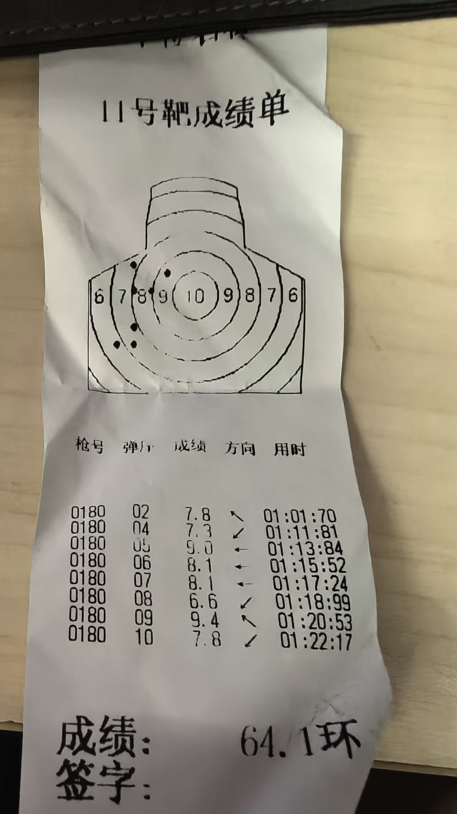
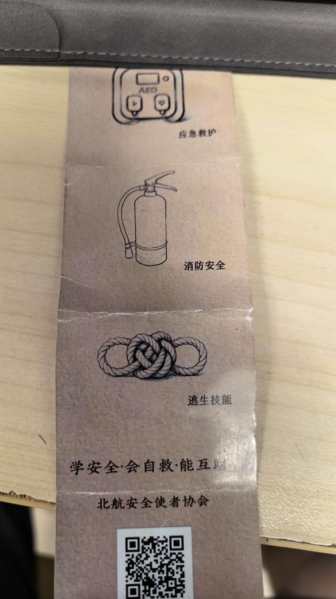

$\textbf{2026/07/27}$
$\texttt{写日记 Day1}$
$\texttt{看看能坚持几天}$
$\texttt{利用千问搭建了github + vscode，也算是为自己的 ACM 生涯开一个头了}$
$\texttt{短期规划：手写补全所有模板}$
$\texttt{长期规划：小号CF/ATC上红}$

$\textbf{2026/07/28}$
$\texttt{写日记 Day2}$ 
$\texttt{简单完善了组合数学，线性代数开了个头}$

$\textbf{2026/07/29}$
$\texttt{写日记 Day3}$
$\texttt{矩阵，行列式，求逆}$
$\texttt{QianWen 还是调教得不够好}$
$\texttt{明天科二，希望一遍过}$

$\textbf{2026/07/30}$
$\texttt{写日记 Day4}$
$\texttt{科目二100pts}$

$\textbf{2026/07/31}$
$\texttt{写日记 Day5}$
$\texttt{难得的 Tish 时间，明天有 CF 记得打}$

$\textbf{2026/08/01}$
$\texttt{Tish 打CF}$

$\textbf{2026/08/02}$
$\texttt{不管罚时怎么样，反正是过了 5 个题，比上次厉害了}$

$\textbf{2026/08/03}$
$\texttt{Tish}$

$\textbf{2026/08/04}$
$\texttt{今天有 Div3，为数不多的 Div3 了}$

$\textbf{2026/08/05}$
$\texttt{虽然没有罚时，而且过了 6 道题，但无奈我是 Untrusted User，不过这样更好了}$
$\texttt{明天又有 Div2}$ 

$\textbf{2026/08/06}$
$\texttt{每天应该提前写这个.. Div2}$

$\textbf{2026/08/07}$
$\texttt{昨天打完 Div2，今天又有 EDU，含 CF 浓度最高的一集}$

$\textbf{2026/08/08}$
$\texttt{被 EDU 的 E 阴到了，Wrong Answer on test 21 是你吗}$

$\textbf{2026/08/09}$
$\texttt{Div2}$ 

$\textbf{2026/08/10}$
$\texttt{Div2 居然下分了，我真是个这个}$

$\textbf{2026/08/11}$
$\texttt{今天又是充实的一天}$

$\textbf{2026/08/12}$
$\texttt{接下来几天啥都干不了，遂提前写了}$

$\textbf{2026/08/13}$
$\texttt{外出}$

$\textbf{2026/08/14}$
$\texttt{外出}$

$\textbf{2026/08/15}$
$\texttt{外出}$

$\textbf{2026/08/16}$
$\texttt{外出}$

$\textbf{2026/08/17}$
$\texttt{外出}$

$\textbf{2026/08/18}$
$\texttt{外出}$

$\textbf{2026/08/19}$
$\texttt{回来了，并配置了新的 PC}$
$\texttt{Thinkbook16+ 5070 i7}$
$\texttt{新电脑测试}$

$\textbf{2026/08/20}$
$\texttt{充实的一天}$

$\textbf{2026/08/21}$
$\texttt{认识了新室友，一个bj，一个sd，一个hb}$

$\textbf{2026/08/22}$
$\texttt{buaa 迎新活动，认识了几位大咖}$

$\textbf{2026/08/23}
$\texttt{明天科目三，希望通过}$

$\textbf{2026/08/24}$
$\texttt{科目三 100 pts，明天科目四，席位通过}$

$\textbf{2026/08/25}$
$\texttt{驾驶证拿到了，明天准备出发}$

$\textbf{2026/08/26}$
$\texttt{充实的一天}$

$\textbf{2026/08/27}$
$\texttt{北京随便逛逛}$

$\textbf{2026/08/28}$
$\texttt{提前先写，避免没时间}$
$\texttt{upd:第一天报道，感觉很科幻。室友：wzg，hwz，}$

$\textbf{2026/08/29}$
$\texttt{提前先写，避免没时间}$
$\texttt{upd:军训第一天，简单记录下内容随便写一些偶然看到的}$
$\texttt{早上吃的鸡蛋+油条+混沌，才花 5 RMB...，好像是二食堂，明天早上应该也是这个，要留意一下。}$
$\texttt{上午开营仪式，教官姓姚（他上午明明说自己姓葛...，学习练军姿，左右对齐}$
$\texttt{中午在另外一个食堂..，不知道是哪一个，享用单人自助，奥尔良鸡腿，两大片肉，番茄炒蛋，山药类似的东西..}$
$\texttt{由于上午练得太烂了...，下午先在太阳下站了 1h..，后面学了转弯（不是科目二那个）}$
$\texttt{下午吃的藤椒抄手，第一次在餐馆里面吃到藤椒口味的...}$
$\texttt{出来然而并没有和我一起回七公寓的同学，撞大运（一语双关）跟着好心同学一起回来了，还好没被督察的抓到。}$
$\texttt{回宿舍洗了下衣服，惊奇地发现大家都在..}$
$\texttt{晚上居然有文艺表演项目...，符合刻板印象，很好的是没有抓我上去，坏的是最后的八名女生没见到，伟大的教官摇过来两名女生，好像都姓赵，具体名字忘了...。虽然玩的很 high 但比舞大获全败，四个营中只拿了第三名。学会了如何蹲下！如何起立！希望明天学习如何走路！}$
$\texttt{姚教官最后说了些语重心长的话，好像军训真的是有三分是训给自己看的，七分给别人看的}$
$\texttt{军训大部分时间都在思考人生..，或者说是在发呆，话说回来我已经很久都没有在学校体验学习的乐趣了，是那种获得新知识，思维瞬间拓宽的快感，我想学校的设计初衷或许如此，可惜在高三我只能在深圳当个小商家，天天炒冷面，把学过的冷过的知识一遍遍炒熟。回想起来知识输入最密集的日子，那些天天在积分听jzp或者学长讲课的日子一去不复返了。但是我觉得，也应该认为，这种快感会马上回显}$
$\texttt{室友都这么爱玩游戏和爱刷视频吗...，第一天住的感觉不管怎么说很奇怪..}$
$\texttt{剩下没想到了明天再补充..}$

$\textbf{2026/08/30}$
$\texttt{给我都提前猜到了...，上午学习单人走路，教官讲他的一些逸事，包括高考520，英语46分和他的两个exnpy}$
$\texttt{中午终于摇到一个人...，和dxp一起，在3食堂吃了番茄牛腩，感觉没家里的好吃...}$
$\texttt{午休的时候室友在 genshin，有点影响睡眠。}$
$\texttt{下午学习集体走路，由于没走好被加训了，虽然我不知道这算加训还是算减训。}$
$\texttt{吃的鸡排拌饭，感觉非常辣鸡，下次别吃了。}$
$\texttt{晚上学习八套军体拳，教官开始摸鱼了，今天居然由有三个人被抓，感觉教官对我们失去信心了。}$
$\texttt{晚上有好梦拓过来送东西。}$
$\texttt{天哪，25届的cq女生居然是班上的3.9/4.0，被震惊到了，但是感谢我们的熊梦拓！要到了联系方式！}$

$\textbf{2026/08/31}$
$\textbf{提前先写，避免没时间}$
$\texttt{上午学习抬腿...，居然是最早放的一次。}$
$\texttt{中午吃的五花肉和烤鸭，焦味太重了，不过爆的汁挺多。}$
$\texttt{下午居然有军事社团来提供改枪码，可惜摸到的不是真枪，不过算是最轻松的一个下午了。}$
$\texttt{晚上选了个看起来好吃的鸡汁米线，但实际上味道一般，尝试更换酸梅汤为木瓜汁，这 tm 是什么玩意。}$
$\texttt{wzg 吃的都比较新奇..，什么生煎包，烤冷面，cq 小伙没吃过这些新奇玩意}$
$\texttt{晚上康导讲了一下选课，和hwz，dxp随便逛了逛校园，去cotti coffee 花9.9 RMB 随便买了个咖啡，但感觉味道和蜜雪冰城的茉莉奶绿差不多...，，随便进去一个计算机学院的空教室都有人...，感觉还是太卷了，还得是我们计拔班。}$
$\texttt{正在研究为什么踏步会越踏越快的问题，可以列为论文参考主题之一。}$

$\textbf{2026/09/01}$
$\texttt{早上居然要吃两个肉夹馍，我真成 David Dai 了（ll}$
$\texttt{上午学习正步走。}$
$\texttt{中午吃的奇怪的牛肉拌饭，和 BS 二楼的某个菜很像。}$
$\texttt{下午打枪，果然还是摸不到荷枪实弹啊，拿个什么激光打，教官说要三点一线，可惜我右眼近视，可惜我不会单闭右眼，在基本上模糊下乱打打了60多分，还有神秘灭火练习}$

$\texttt{还有这种奇怪自救社团，请问谁的爱好是自救？}$
$\texttt{回来之后前面的一名同学由于[你吼那么大声干什么啦]被教官杀鸡儆猴了，连长+团长的组合拳还是太有威力，足足值得为这名同学进行 1 ms 的停工缅怀。}$
$\texttt{晚上吃到好东西了，美味的肥牛滑蛋，我草太下饭了。}$
$\texttt{进行了进入大学后的第一场考试，早知道阅读做这么快就好好看听力了，下次一定，嗯，下次一定。}$
$\texttt{明天大清早要执勤啊}$

$\textbf{2026/09/02}$
$\texttt{md，早上执勤居然没定闹钟，但靠吃老本的老时钟在起床内五分钟成功下楼！}$
$\texttt{另一位同学是河北衡中的，强大！！！}$
$\texttt{早上吃的葱油饼，还不错}$
$\texttt{上午啥也没学，还是练习走路，发现我不会走路了，我们这一列不会走路了，我们所有人都不会走路了。}$
$\texttt{中午居然只有 20 min 的 Tish 时间，只能 rush 一下豌杂面，味道一般...，可能是在 cq 吃太好了}$
$\texttt{下午尝试学习冷兵器，学习著名的从女子学校流传至军队的🗡操}$
$\texttt{下午忘记整啥花活了，还是吃的烤鸭和五花肉。}$
$\texttt{晚上教官不在疯狂 Tish，一个小时之后教官疯狂了，还好我们8点钟可以提前回来。}$